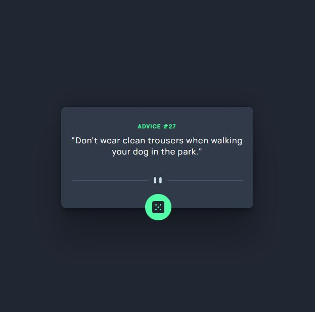

# Advice Generator

 ## About the Project

 A random advice generator. [Frontendmentor coding challenge ](https://www.frontendmentor.io/challenges/advice-generator-app-QdUG-13db)

## Table of contents

  - [The challenge](#the-challenge)
  - [Screenshot](#screenshot)
  - [Links](#links)
  - [Built with](#built-with)
  - [Author](#author)

### The challenge

The challenge is to build a Random Advice Generator

### Screenshot

### Links

- Solution URL: [Github repository link](https://github.com/smtoyedeji/advicegenerator.github.io.git)
- Live Site URL: [Live site URL](https://smtoyedeji.github.io/advicegenerator/)

### Built with

- Semantic HTML5 markup
- CSS custom properties
- Flexbox
- CSS Grid
- Vanilla Javascript
- API integration

## Author

- Twitter - [@oyedeji__](https://www.twitter.com/oyedeji__)

